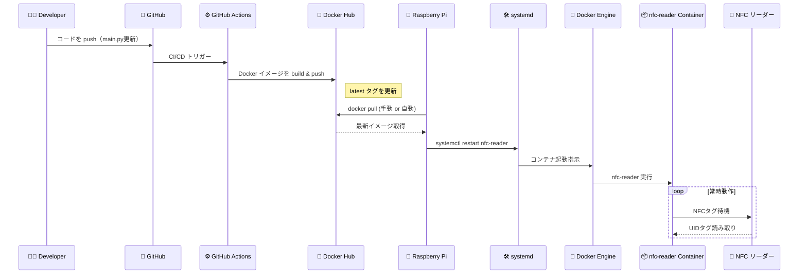

```mermaid
sequenceDiagram
    participant Dev as 👨‍💻 Developer
    participant GitHub as 🐙 GitHub
    participant Actions as ⚙️ GitHub Actions
    participant DockerHub as 🐳 Docker Hub
    participant Pi as 🍓 Raspberry Pi
    participant systemd as 🛠 systemd
    participant Docker as 🐋 Docker Engine
    participant Container as 📦 nfc-reader Container
    participant NFC as 📶 NFC リーダー

    Dev->>GitHub: コードを push（main.py更新）
    GitHub->>Actions: CI/CD トリガー
    Actions->>DockerHub: Docker イメージを build & push
    Note right of DockerHub: latest タグを更新

    Pi->>DockerHub: docker pull (手動 or 自動)
    DockerHub-->>Pi: 最新イメージ取得
    Pi->>systemd: systemctl restart nfc-reader
    systemd->>Docker: コンテナ起動指示
    Docker->>Container: nfc-reader 実行
    loop 常時動作
        Container->>NFC: NFCタグ待機
        NFC-->>Container: UIDタグ読み取り
    end
```